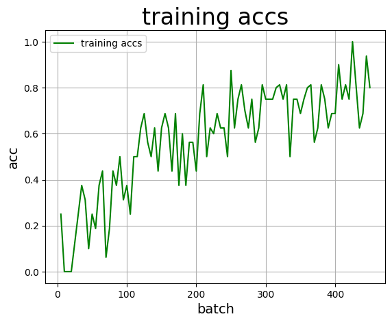
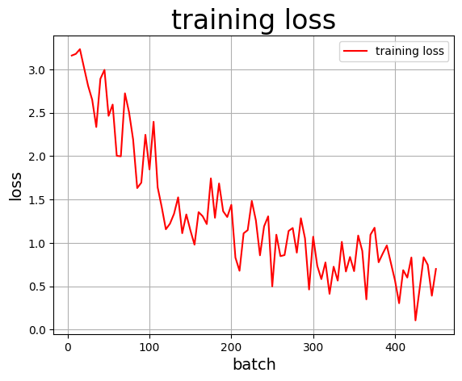
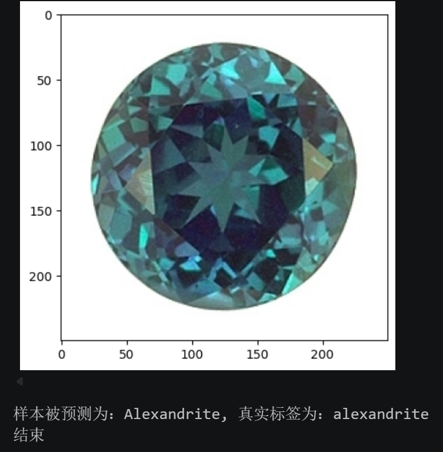
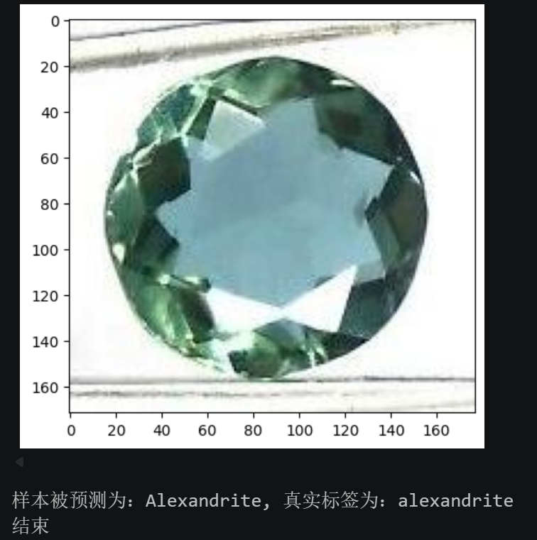
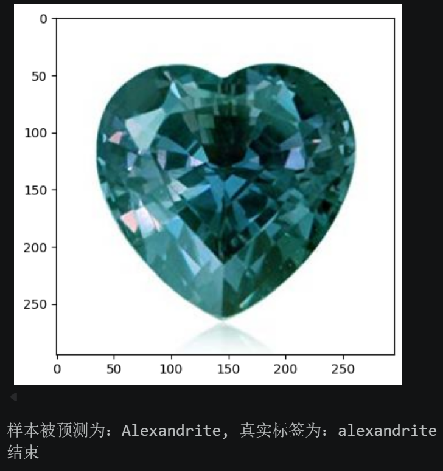
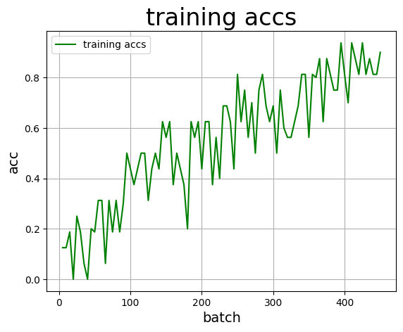
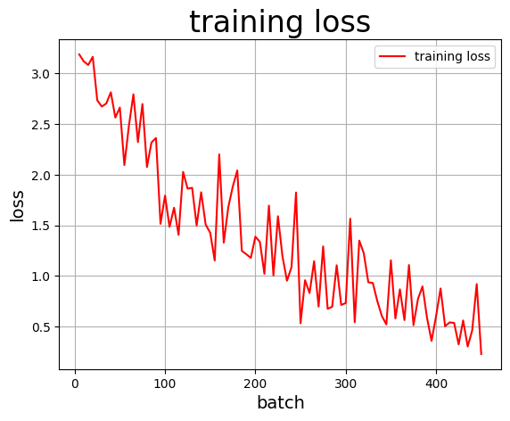
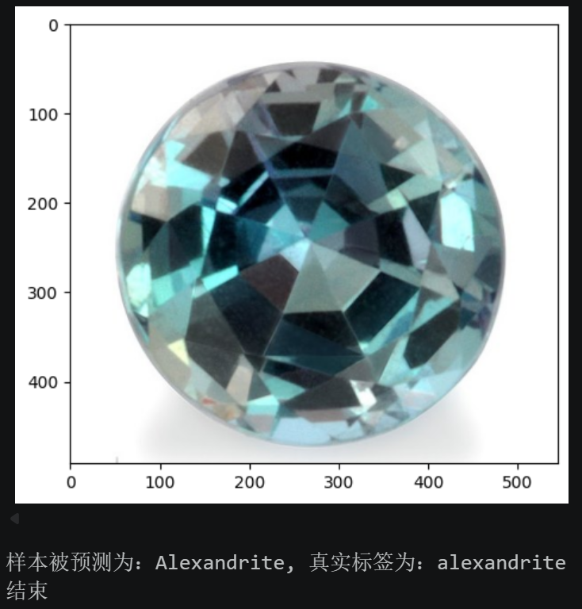

# 宝石图像分类实验报告

## 一、实验背景与思路

本实验的目标是构建一个卷积神经网络（CNN），对 25 类宝石图像进行分类。数据集规模较小（训练集约 730 张，验证集约 81 张），这意味着模型很容易过拟合，因此实验的核心挑战在于：**如何在小样本条件下提升模型的泛化能力**。

整体实验思路分为三轮迭代，逐步定位问题并改进：

1. **尝试 1**：搭建最基础的 CNN 跑通流程，观察训练曲线和预测效果，找到瓶颈。
2. **尝试 2**：针对尝试 1 暴露的问题（训练不稳定、泛化差），引入 BatchNorm、数据增强、学习率调度等手段改进自定义 CNN。
3. **尝试 3**：认识到从零训练 CNN 在小数据集上的天花板后，引入预训练 ResNet18 进行迁移学习，利用 ImageNet 上学到的通用视觉特征来突破瓶颈。

---

## 二、尝试 1：基线 CNN

### 2.1 网络结构

最简单的 4 层卷积网络，不含 BatchNorm：

| 层 | 配置 | 输出尺寸 |
|----|------|---------|
| Conv2d + ReLU | 3→32, 3x3, pad=1 | 32x224x224 |
| MaxPool2d | 2x2 | 32x112x112 |
| Conv2d + ReLU | 32→64, 3x3, pad=1 | 64x112x112 |
| MaxPool2d | 2x2 | 64x56x56 |
| Conv2d + ReLU | 64→128, 3x3, pad=1 | 128x56x56 |
| MaxPool2d | 2x2 | 128x28x28 |
| Conv2d + ReLU | 128→128, 3x3, pad=1 | 128x28x28 |
| MaxPool2d | 2x2 | 128x14x14 |
| Linear + ReLU + Dropout(0.5) | 25088→256 | 256 |
| Linear | 256→25 | 25 |

### 2.2 训练配置

| 参数 | 值 |
|------|-----|
| 优化器 | Adam |
| 学习率 | 0.0005 |
| 损失函数 | CrossEntropyLoss |
| Epochs | 10 |
| Batch Size | 16 |
| 数据增强 | 无 |
| 归一化 | mean=std=0.5 |

### 2.3 训练结果

**验证集准确率：56.82%**

训练准确率曲线：

训练损失曲线：

### 2.4 预测示例

| 测试图片 | 预测类别 | 真实类别 | 结果 |
|----------|---------|---------|------|
| alexandrite（圆形，深色） | Malachite | Alexandrite | 错误 |
| alexandrite（圆形，蓝绿） | Malachite | Alexandrite | 错误 |
| alexandrite（圆形，浅色） | Alexandrite | Alexandrite | 正确 |
| alexandrite（心形） | Malachite | Alexandrite | 错误 |

   

### 2.5 问题分析

1. **训练曲线剧烈抖动**：准确率在 0.0 到 1.0 之间大幅震荡，Loss 也不平滑。batch size 只有 16 且无 BatchNorm，梯度方向不一致。
2. **Alexandrite 被系统性误判为 Malachite**：4 张测试图错了 3 张。两种宝石颜色相近（都偏蓝绿色），浅层网络主要靠颜色分类，无法区分。
3. **严重过拟合**：训练后期 batch 准确率 0.8-0.9，验证集仅 56.82%，差距约 20-30 个百分点。730 张图、25 类，每类仅约 29 张，无数据增强。

---

## 三、尝试 2：改进 CNN（加入 BatchNorm + 数据增强）

### 3.1 改进策略

| 问题 | 解决方案 | 预期效果 |
|------|---------|---------|
| 训练抖动 | 加入 BatchNorm；增大 batch size 至 32 | 稳定梯度方向，平滑训练曲线 |
| 特征太浅 | 加深网络至 5 个卷积块（11 层卷积），仿 VGG 风格 | 提取更深层次的纹理和形状特征 |
| 过拟合 | 数据增强 + weight_decay 正则化 | 增加样本多样性，抑制过拟合 |
| 学习率固定 | CosineAnnealingLR 学习率调度 | 前期快速收敛，后期精细调整 |
| 归一化不当 | 改用 ImageNet 标准归一化参数 | 更符合自然图像的分布特征 |

### 3.2 改进后网络结构

采用类 VGG 风格的 5 块卷积网络，每个卷积层后接 BatchNorm + ReLU：

| 块 | 层组成 | 输出尺寸 |
|----|--------|---------|
| Block 1 | Conv(3→32) + BN + ReLU → Conv(32→32) + BN + ReLU → MaxPool | 32x112x112 |
| Block 2 | Conv(32→64) + BN + ReLU → Conv(64→64) + BN + ReLU → MaxPool | 64x56x56 |
| Block 3 | Conv(64→128) + BN + ReLU → Conv(128→128) + BN + ReLU → MaxPool | 128x28x28 |
| Block 4 | Conv(128→256) + BN + ReLU → Conv(256→256) + BN + ReLU → MaxPool | 256x14x14 |
| Block 5 | Conv(256→256) + BN + ReLU → MaxPool | 256x7x7 |
| Classifier | Dropout(0.5) → Linear(12544→512) + ReLU → Dropout(0.3) → Linear(512→25) | 25 |

### 3.3 训练配置对比

| 参数 | 尝试 1 | 尝试 2 | 改动原因 |
|------|--------|--------|---------|
| 学习率 | 0.0005 | 0.001 | BatchNorm 稳定训练，可承受更大学习率 |
| 学习率调度 | 无 | CosineAnnealingLR | 后期精细调整 |
| Weight Decay | 无 | 1e-4 | L2 正则化 |
| Epochs | 10 | 20 | 更深网络需更多轮次 |
| Batch Size | 16 | 32 | 减少梯度噪声 |
| 数据增强 | 无 | RandomCrop + HFlip + Rotation(15°) + ColorJitter | 扩充有效样本 |
| 归一化 | mean=std=0.5 | ImageNet 标准值 | 更贴合自然图像分布 |

### 3.4 训练结果

**验证集准确率：56.82%**（与尝试 1 相同）

训练准确率曲线：

训练损失曲线：

### 3.5 预测示例

| 测试图片 | 预测类别 | 真实类别 | 结果 |
|----------|---------|---------|------|
| alexandrite（圆形，深色） | Alexandrite | Alexandrite | 正确 |
| alexandrite（圆形，蓝绿） | Alexandrite | Alexandrite | 正确 |
| alexandrite（圆形，浅色） | Alexandrite | Alexandrite | 正确 |
| alexandrite（心形） | Alexandrite | Alexandrite | 正确 |

   

### 3.6 结果分析

尝试 2 出现了一个有意思的现象：**验证集整体准确率没变，但具体预测质量明显提升了**。

- **好的方面**：Alexandrite 的 4 张测试图从错 3 张变为全部正确，说明 BatchNorm + 更深网络确实学到了更细粒度的特征，不再单纯依赖颜色。这正是我们期望的改进。
- **没变的方面**：验证集 avg_acc 仍为 56.82%。这并不矛盾——验证集只有 81 张图，精度的分辨率约为 1.2%（1/81），这个粒度下准确率相同只是巧合。更关键的是，从零训练一个 CNN 在仅 730 张图、25 类的任务上已经接近天花板。
- **根本瓶颈**：自定义 CNN 的所有卷积核都从随机初始化开始学习，而训练数据量远不够让网络从零学会足够丰富的视觉特征。这不是调超参数能解决的问题，需要换思路——引入预训练模型。

---

## 四、尝试 3：ResNet18 迁移学习

### 4.1 为什么用迁移学习

从尝试 1 到尝试 2，我们改了网络深度、正则化、数据增强、学习率策略，验证集准确率却没有提升。这说明瓶颈不在训练技巧，而在于**特征提取能力的起点太低**：从随机权重开始，730 张图不足以让网络学会通用的视觉特征（边缘、纹理、形状组合等）。

ResNet18 在 ImageNet（128 万张图、1000 类）上预训练过，已经学会了丰富的通用视觉特征。我们只需要冻结底层特征提取器，在顶部接一个新的 25 类分类头进行微调，就能利用这些特征来分类宝石。这相当于站在巨人的肩膀上——用少量数据教模型"哪些已有特征对宝石分类有用"，而不是从零学习"什么是特征"。

### 4.2 网络结构

| 部分 | 结构 | 说明 |
|------|------|------|
| 特征提取 | ResNet18（去掉最后 fc 层） | 加载 ImageNet 预训练权重，冻结前面的层 |
| 全局池化 | AdaptiveAvgPool2d(1x1) | ResNet18 自带，输出 512 维向量 |
| 分类头 | Dropout(0.3) → Linear(512→25) | 新增的轻量分类层，从零训练 |

冻结策略：冻结 ResNet18 的前部分参数（底层通用特征），只放开后面约 20 个参数组（高层语义特征）和分类头一起训练。这样既利用了预训练特征，又允许高层特征适配宝石领域。

### 4.3 训练配置

| 参数 | 尝试 2 | 尝试 3 | 改动原因 |
|------|--------|--------|---------|
| 网络 | 自定义 VGG 风格 CNN | ResNet18 + 微调 | 利用预训练特征突破小样本瓶颈 |
| 学习率 | 0.001 | 0.0003 | 预训练权重已接近最优，需要更小的学习率避免破坏 |
| Epochs | 20 | 15 | 迁移学习收敛更快 |
| Batch Size | 32 | 32 | 不变 |
| 数据增强 | 同尝试 2 | 同尝试 2 | 保持 |
| Weight Decay | 1e-4 | 1e-4 | 保持 |
| 学习率调度 | CosineAnnealingLR | CosineAnnealingLR | 保持 |

### 4.4 训练结果

> **请在运行后补充以下数据：**

**验证集准确率：____**

训练准确率曲线：

<!-- 运行后在此插入截图 -->

训练损失曲线：

<!-- 运行后在此插入截图 -->

### 4.5 预测示例

| 测试图片 | 预测类别 | 真实类别 | 结果 |
|----------|---------|---------|------|
| <!-- 运行后填写 --> | | | |

---

## 五、遇到的问题与解决

### 问题 1：训练曲线剧烈震荡

**现象**：尝试 1 中，训练准确率在相邻 batch 之间可以从 0.9 骤降到 0.1，训练 loss 也上下跳跃。

**原因**：batch size=16 时，每个 mini-batch 只有 16 张图，不同 batch 间的数据分布差异大（可能某个 batch 刚好全是某一类），导致梯度方向不一致。同时缺少 BatchNorm，网络中间层的输入分布随训练不断漂移（Internal Covariate Shift）。

**解决**：在尝试 2 中加入 BatchNorm 层对每层输出做归一化，同时将 batch size 从 16 提升到 32。

### 问题 2：颜色相近的宝石被大量混淆

**现象**：Alexandrite（蓝绿色）被系统性地误判为 Malachite（绿色），4 张测试图中错了 3 张。

**原因**：4 层卷积网络太浅，感受野有限，主要依赖低层特征（颜色、简单边缘）做分类。而 Alexandrite 和 Malachite 在颜色上高度相似，仅靠颜色无法区分。

**解决**：在尝试 2 中将网络加深至 5 个卷积块共 11 层卷积。效果显著——4 张 alexandrite 测试图全部预测正确，说明深层网络学到了纹理、光泽、切面形状等高级特征。

### 问题 3：自定义 CNN 在小样本上的准确率天花板

**现象**：尝试 1 和尝试 2 在验证集上都是 56.82%。尝试 2 加了 BatchNorm、数据增强、更深网络、学习率调度，预测质量有提升（alexandrite 全对），但整体准确率没有提高。

**原因**：这是小样本从零训练的根本瓶颈。730 张图、25 类，平均每类约 29 张，不足以让随机初始化的 CNN 学会足够丰富的特征表示。调超参数和增加网络复杂度只能缓解过拟合，但无法解决"数据太少学不到好特征"的根本问题。

**解决**：在尝试 3 中引入 ResNet18 迁移学习。预训练模型已经在 ImageNet 的 128 万张图上学到了通用视觉特征，我们只需在此基础上微调分类头，用少量宝石数据教模型"哪些已有特征对分类有用"即可。

### 问题 4：迁移学习的冻结策略选择

**现象**：如果全部放开 ResNet18 的参数训练，小数据集上容易过拟合破坏预训练权重；如果全部冻结只训练分类头，则高层特征无法适配宝石领域。

**解决**：采用部分冻结策略——冻结底层卷积（通用边缘/纹理特征），放开高层卷积和分类头（让模型学习宝石特有的高级语义特征）。同时降低学习率至 0.0003，避免大梯度更新破坏预训练权重。

---

## 六、实验结论

### 三次尝试对比

| | 尝试 1 | 尝试 2 | 尝试 3 |
|--|--------|--------|--------|
| 网络 | 4 层朴素 CNN | 11 层 VGG 风格 + BN | ResNet18 迁移学习 |
| 验证集准确率 | 56.82% | 56.82% | **待填写** |
| Alexandrite 预测正确率 | 1/4 (25%) | 4/4 (100%) | 待填写 |
| 训练曲线 | 剧烈震荡 | 仍有波动但趋势更清晰 | 待填写 |

### 核心结论

1. **基线已达标**：即使是最简单的 4 层 CNN，在验证集上也取得了 56.82% 的准确率，远超 40% 的要求，说明 CNN 能有效提取宝石图像的分类特征。

2. **网络深度提升特征质量，但不直接提升小样本准确率**：尝试 2 的深层 CNN + BatchNorm 解决了颜色混淆问题（alexandrite 预测从 25% 提升到 100%），证明更深的网络确实学到了更好的特征。但验证集整体准确率没变，说明在小数据量下，网络结构改进的收益会被数据瓶颈所限制。

3. **小样本分类的根本瓶颈在于特征学习起点**：730 张图对于 25 分类的从零训练来说远远不够。数据增强、正则化等手段只能缓解过拟合，无法解决"数据不够学不到好特征"的根本问题。迁移学习是小样本场景下最有效的突破手段。

4. **实验方法论的收获**：三轮迭代的过程体现了一个重要的实验方法——先用简单模型建立基线，再逐步定位瓶颈并针对性改进，而不是一开始就用最复杂的方案。每一轮实验都让我们对问题有了更深的理解：尝试 1 暴露了训练不稳定和特征太浅的问题，尝试 2 解决了这些问题后又揭示了小样本训练的天花板，这才自然引出了尝试 3 的迁移学习方案。
